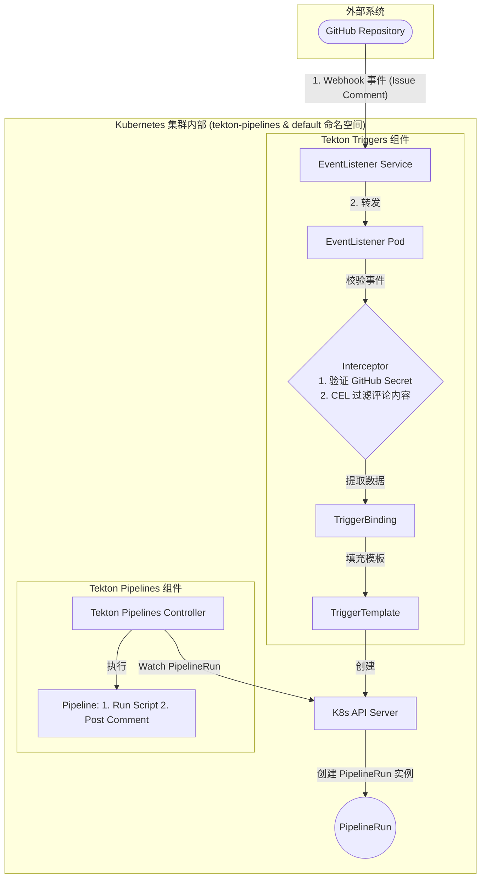
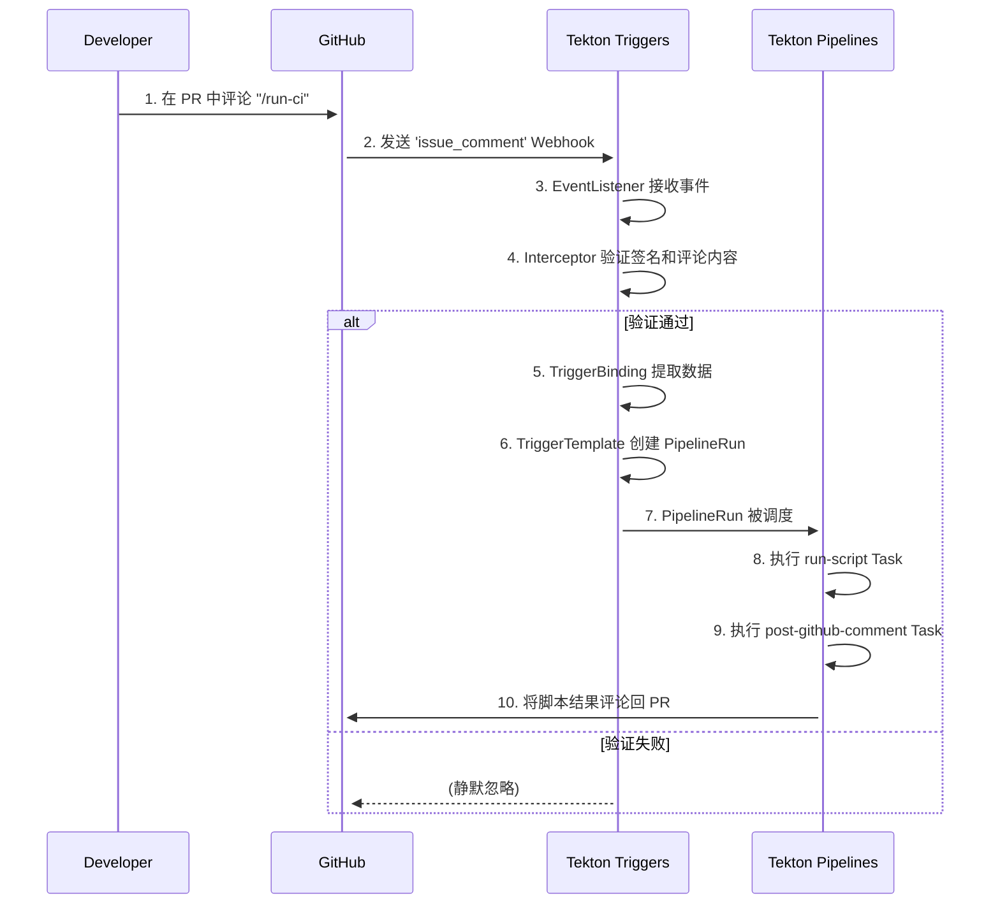

好的，当然可以。下面我将为您生成一份完整的技术设计文档，格式模仿 Google Docs 的风格，详细阐述使用纯 Tekton 方案实现该功能的全部细节。

---

## **技术设计文档：基于 Tekton 的自动化 GitHub 工作流机器人**

| **文档状态** | 草案 |
| :--- | :--- |
| **版本** | 1.0 |
| **作者** | 云原生技术专家 (AI) |
| **创建日期** | 2023-10-27 |
| **审阅人** | [您的名字/团队] |

### 1. 概述 (Overview)

本文档旨在设计一个全自动化的云原生工作流机器人。该机器人能够监听特定 GitHub 仓库的事件（如在 PR/Issue 下发表特定评论），根据事件内容触发预定义的 CI 脚本，并将脚本的执行结果以评论的形式反馈回原始的 PR 或 Issue 中。

本设计的核心原则是**完全采用声明式配置**，利用 **Tekton** 生态系统（包括 **Tekton Pipelines** 和 **Tekton Triggers**）来实现整个工作流程，**无需编写和维护任何自定义的 Controller 代码**。这种方法最大限度地提高了与云原生和 GitOps 实践的契合度，降低了长期维护成本。

### 2. 目标与非目标 (Goals and Non-Goals)

#### 2.1 目标 (Goals)

*   **事件驱动**: 能够接收并处理来自 GitHub 的 `issue_comment` Webhook 事件。
*   **命令触发**: 只有当评论内容为特定命令（例如 `/run-ci`）时，才触发后续任务。
*   **动态任务执行**: 能够克隆与事件关联的仓库和分支，并执行仓库中预定义的脚本（例如 `.ci/run.sh`）。
*   **结果反馈**: 将脚本的执行输出（stdout/stderr）作为评论内容，自动发布回触发事件的 PR/Issue。
*   **纯声明式实现**: 整个解决方案仅通过 Kubernetes YAML 清单（CRD）进行定义和配置。
*   **技术栈**: 严格使用 Tekton Pipelines 和 Tekton Triggers 作为核心引擎。

#### 2.2 非目标 (Non-Goals)

*   **通用 CI/CD平台**: 本设计不旨在创建一个功能完备的通用 CI/CD 系统，而是专注于解决上述特定场景。
*   **多平台支持**: 初期版本仅支持 GitHub，不考虑 GitLab, Bitbucket 等其他代码托管平台。
*   **图形用户界面 (UI)**: 不提供任何用于查看或管理工作流的 UI 界面。所有操作均通过 `kubectl` 和 Git 完成。

### 3. 架构设计 (Architecture)

本方案的核心是 Tekton Triggers，它作为连接外部事件和内部 CI/CD 流水线的桥梁。

#### 3.1 架构图



#### 3.2 组件说明

*   **EventListener**: 一个 Kubernetes Service，暴露一个 HTTP 端点以接收 GitHub Webhook。它是整个流程的入口。
*   **Interceptor**: 一个处理中间件。在本设计中，我们使用两个 Interceptor：
    1.  **GitHub Interceptor**: 验证 Webhook 请求的签名，确保请求来自合法的 GitHub 源。
    2.  **CEL Interceptor**: 使用 Common Expression Language (CEL) 检查 Webhook 的 JSON body，过滤出内容为 `/run-ci` 的评论事件。
*   **TriggerBinding**: 从合法的事件 payload 中提取所需信息（如仓库 URL、分支引用、Issue 编号等）。
*   **TriggerTemplate**: 一个资源模板，它接收 `TriggerBinding` 提取的数据，并用这些数据来动态生成一个 `PipelineRun` 资源。
*   **Pipeline**: 定义了具体要执行的一系列任务（`Tasks`）及其执行顺序。在我们的场景中，它包含两个任务：
    1.  `run-ci-script`: 克隆代码并执行脚本。
    2.  `post-github-comment`: 将前一个任务的结果发布回 GitHub。
*   **PipelineRun**: `Pipeline` 的一个具体运行实例。由 `TriggerTemplate` 创建。

### 4. 详细设计与实现 (Detailed Design)

#### 4.1 准备工作

1.  **安装 Helm**: 确保本地已安装 Helm v3+。
2.  **安装 Tekton Pipelines**:
    ```bash
    helm repo add tekton https://tekton-releases.storage.googleapis.com/charts
    helm repo update
    helm install tekton-pipelines tekton/tekton-pipeline -n tekton-pipelines --create-namespace
    ```
3.  **安装 Tekton Triggers**:
    ```bash
    kubectl apply -f https://storage.googleapis.com/tekton-releases/triggers/latest/release.yaml
    kubectl apply -f https://storage.googleapis.com/tekton-releases/triggers/latest/interceptors.yaml
    ```
4.  **创建 Kubernetes Secret**: 用于存放 GitHub Personal Access Token (PAT) 和 Webhook Secret。
    ```bash
    kubectl create secret generic github-secret \
      --from-literal=token=your_github_pat_here \
      --from-literal=secret=a_very_strong_and_random_string
    ```

#### 4.2 步骤 1: 定义核心任务与流水线 (Tasks & Pipeline)

首先，定义流水线中需要执行的原子任务。

**任务 1: `task-run-ci-script.yaml`**
*此任务负责克隆指定仓库和分支，并执行 `.ci/run.sh` 脚本。*
```yaml
apiVersion: tekton.dev/v1
kind: Task
metadata:
  name: run-ci-script
spec:
  params:
    - name: repoURL
    - name: revision
  workspaces:
    - name: source
  results:
    - name: output
      description: The output of the executed script.
  steps:
    - name: clone-and-run
      image: alpine/git:latest
      workingDir: $(workspaces.source.path)
      script: |
        #!/bin/sh
        set -e
        git clone $(params.repoURL) .
        git checkout $(params.revision)
        
        SCRIPT_PATH=".ci/run.sh"
        if [ -f "$SCRIPT_PATH" ]; then
          echo "--- Running $SCRIPT_PATH ---"
          # Execute and pipe output to the result file
          sh "$SCRIPT_PATH" | tee $(results.output.path)
        else
          echo "Error: Script $SCRIPT_PATH not found." | tee $(results.output.path)
          exit 1
        fi
```

**任务 2: `task-post-github-comment.yaml`**
*此任务负责将结果评论回 GitHub。*
```yaml
apiVersion: tekton.dev/v1
kind: Task
metadata:
  name: post-github-comment
spec:
  params:
    - name: repo_full_name
    - name: issue_number
    - name: comment_body
  steps:
    - name: post-comment
      image: curlimages/curl:8.4.0
      script: |
        #!/bin/sh
        # Format the result into a proper JSON payload
        PAYLOAD=$(printf '{"body": "%s"}' "$(params.comment_body)")
        curl -s -X POST \
          -H "Authorization: Bearer $(cat /etc/github/token)" \
          -H "Accept: application/vnd.github.v3+json" \
          "https://api.github.com/repos/$(params.repo_full_name)/issues/$(params.issue_number)/comments" \
          -d "$PAYLOAD"
      volumeMounts:
        - name: github-token
          mountPath: /etc/github
          readOnly: true
  volumes:
    - name: github-token
      secret:
        secretName: github-secret
```

**流水线: `ci-pipeline.yaml`**
*此流水线编排上述两个任务，将第一个任务的结果传递给第二个任务。*
```yaml
apiVersion: tekton.dev/v1
kind: Pipeline
metadata:
  name: github-pr-ci-pipeline
spec:
  params:
    - name: repoURL
    - name: revision
    - name: repoFullName
    - name: issueNumber
  workspaces:
    - name: source
  tasks:
    - name: run-script
      taskRef: { name: run-ci-script }
      workspaces:
        - name: source
          workspace: source
      params:
        - name: repoURL
          value: $(params.repoURL)
        - name: revision
          value: $(params.revision)
    - name: report-results
      runAfter: [ "run-script" ]
      taskRef: { name: post-github-comment }
      params:
        - name: repo_full_name
          value: $(params.repoFullName)
        - name: issue_number
          value: $(params.issueNumber)
        - name: comment_body
          value: |
            ### CI Task Result
            ```
            $(tasks.run-script.results.output)
            ```
```

#### 4.3 步骤 2: 配置触发器组件 (Triggers)

**TriggerBinding: `binding-github-comment.yaml`**
*从 webhook payload 中提取信息。*
```yaml
apiVersion: triggers.tekton.dev/v1beta1
kind: TriggerBinding
metadata:
  name: github-comment-binding
spec:
  params:
    - name: repo-url
      value: $(body.repository.clone_url)
    - name: repo-full-name
      value: $(body.repository.full_name)
    - name: issue-number
      value: $(body.issue.number)
    - name: revision
      # NOTE: This requires a pre-processing step for a robust solution.
      # For a simple demo, we fetch the head ref of the PR.
      value: $(body.issue.pull_request.url) 
```
> **注意**: `body.issue.pull_request.url` 返回的是 API URL。一个生产级的解决方案需要增加一个任务来调用此 URL 以获取 `head.ref`。

**TriggerTemplate: `template-ci-pipeline.yaml`**
*使用提取出的信息来实例化一个 `PipelineRun`。*
```yaml
apiVersion: triggers.tekton.dev/v1beta1
kind: TriggerTemplate
metadata:
  name: ci-pipeline-template
spec:
  params:
    - name: repo-url
    - name: revision
    - name: repo-full-name
    - name: issue-number
  resourcetemplates:
    - apiVersion: tekton.dev/v1
      kind: PipelineRun
      metadata:
        generateName: pr-ci-run-
      spec:
        pipelineRef:
          name: github-pr-ci-pipeline
        workspaces:
          - name: source
            volumeClaimTemplate:
              spec:
                accessModes: [ "ReadWriteOnce" ]
                resources:
                  requests: { storage: 1Gi }
        params:
          - name: repoURL
            value: $(tt.params.repo-url)
          - name: revision
            value: $(tt.params.revision) # Placeholder, needs improvement
          - name: repoFullName
            value: $(tt.params.repo-full-name)
          - name: issueNumber
            value: $(tt.params.issue-number)
```

**EventListener: `listener-github.yaml`**
*将所有触发器组件连接起来的入口点。*
```yaml
apiVersion: triggers.tekton.dev/v1beta1
kind: EventListener
metadata:
  name: github-listener
spec:
  serviceAccountName: tekton-triggers-sa # This SA needs permissions to create PipelineRuns
  triggers:
    - name: github-pr-comment-trigger
      bindings:
        - ref: github-comment-binding
      template:
        ref: ci-pipeline-template
      interceptors:
        - ref:
            name: "github"
          params:
            - name: secretRef
              value:
                secretName: github-secret
                secretKey: secret
            - name: eventTypes
              value: ["issue_comment"]
        - ref:
            name: "cel"
          params:
            - name: "filter"
              value: "body.action == 'created' && body.comment.body.trim() == '/run-ci'"
```

#### 4.4 步骤 3: 部署与暴露服务

1.  **应用所有 YAML 文件**:
    ```bash
    kubectl apply -f task-run-ci-script.yaml
    kubectl apply -f task-post-github-comment.yaml
    kubectl apply -f ci-pipeline.yaml
    kubectl apply -f binding-github-comment.yaml
    kubectl apply -f template-ci-pipeline.yaml
    # Note: Create necessary RBAC for the ServiceAccount 'tekton-triggers-sa'
    kubectl apply -f listener-github.yaml
    ```
2.  **暴露 EventListener 服务**:
    使用 `ngrok` 或 Ingress 将 `EventListener` 创建的 Service 暴露给公网。
    ```bash
    # Forward the service port
    kubectl port-forward svc/el-github-listener 8080:8080 &
    # Get public URL from ngrok
    ngrok http 8080
    ```
3.  **配置 GitHub Webhook**:
    *   前往目标仓库的 `Settings > Webhooks`。
    *   **Payload URL**: 填入 `ngrok` 提供的公网 URL。
    *   **Content type**: `application/json`。
    *   **Secret**: 填入之前在 k8s secret 中设置的 webhook secret。
    *   **Events**: 选择 `Issue comments`。

### 5. 用户工作流 (User Workflow)



### 6. 备选方案评估 (Alternatives Considered)

*   **自定义 Go Controller**:
    *   **优点**: 极高的灵活性，可以在 Go 代码中实现任何复杂的触发前置逻辑。
    *   **缺点**: 需要编写、构建、测试和维护一个自定义的应用程序。开发和维护成本更高，偏离了纯声明式的理念。
    *   **结论**: 对于当前需求，该方案过于复杂，属于“杀鸡用牛刀”。

**选择纯 Tekton 方案的理由**: 本方案完美契合当前的需求，无需引入额外的编程复杂性。它完全拥抱了云原生的声明式和可组合的特性，是 Tekton 设计初衷的最佳实践。

---